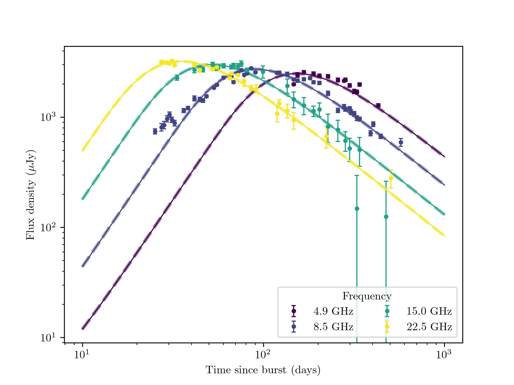
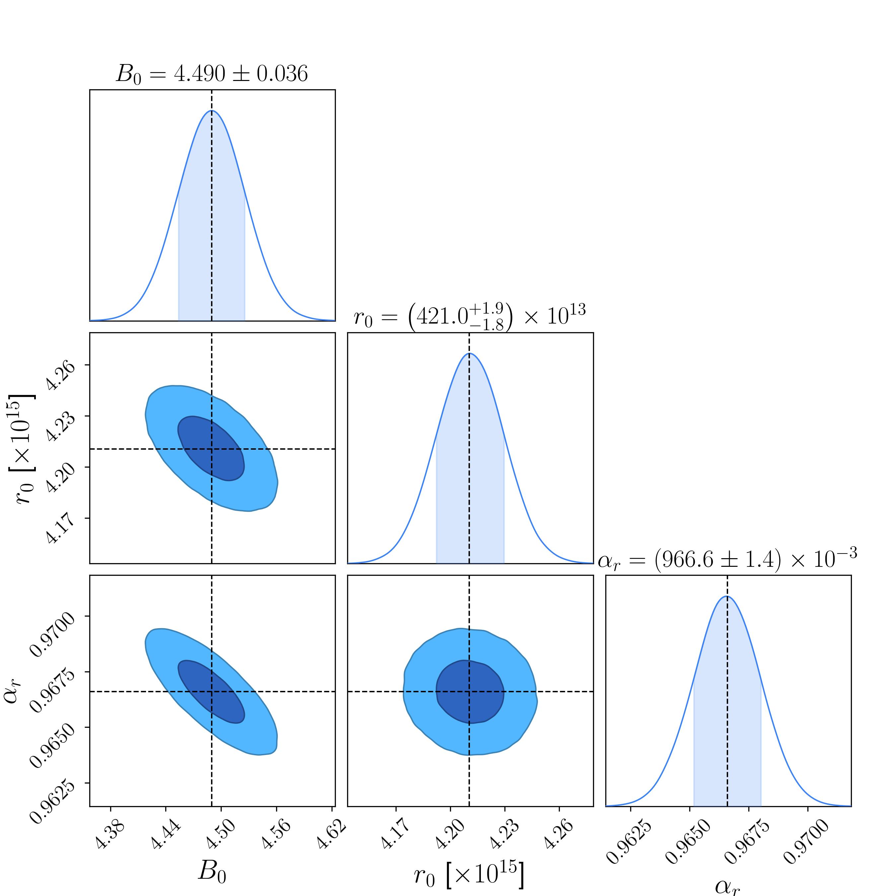
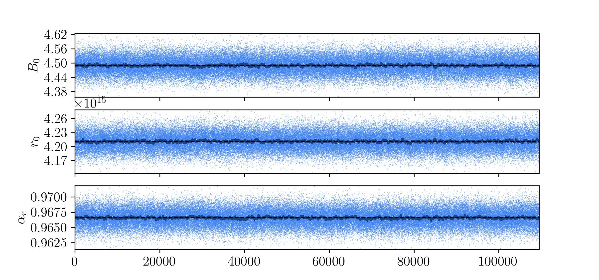
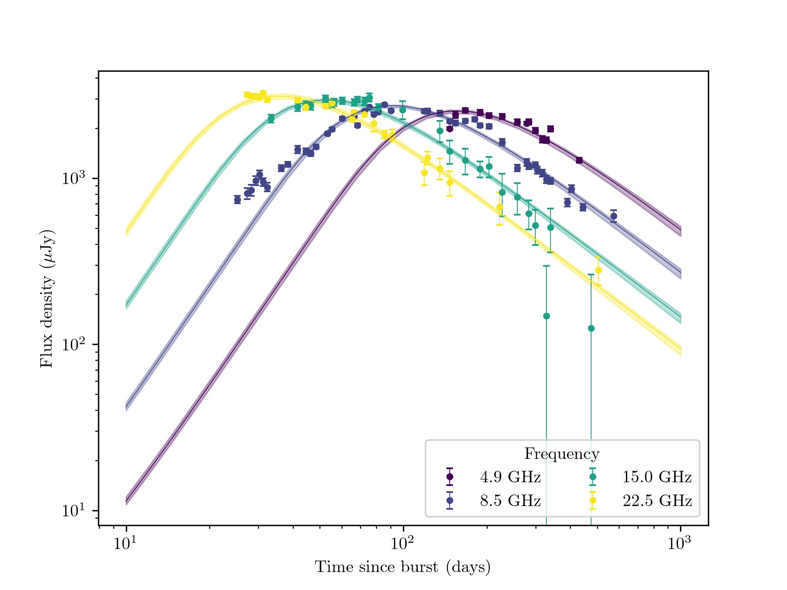

# PySSA  
Python implementation of the Sychrotron Self Absorbed (SSA) model from
[Soderberg et al. 2005](https://ui.adsabs.harvard.edu/abs/2005ApJ...621..908S/abstract)

## Installation

```
pip install -r requirements.txt
```

The plotting scripts set `text.usetex=True`, which additionally needs a system LaTeX
installation plus `dvipng` (not installable via pip). Set it to `False` to skip that.

## Usage 
- Use `PySSA.py` to generate an SSA lightcurve for your choice of parameters. 
- The `comprehensive_soderberg_data.csv` file contains the relevant data from the above paper to plot the light curve for supernova 2003L.
- The `plot_lc.py` code allows you to make the lightcurve  plot. Here the example shown is to reproduce figure 2 (only with model 1) of the above paper. The solid line is calculated from scratch while the dashed line uses interpolation to speed up the calculation.
<p align="center">
   
</p>
<p align="center">
  Here is the output lightcurve. Compare this with Figure 2 (only with model 1) of <a href="https://ui.adsabs.harvard.edu/abs/2005ApJ...621..908S/abstract">Soderberg et al. 2005</a>. The dashed curves are from the fast interpolation calculation.
</p>

- Use `SSA_MCMC_fit.py` to perform fit of the SSA model. `MCMC_plotter.py` helps to plot the corner plot and the walks (see the package [ChainConsumer](https://samreay.github.io/ChainConsumer/)).
  
<p align="center">
   
</p>
<p align="center" >
   
</p>
<p align="center">
  Corner plot (top) and walks (bottom) obtained after SSA fit on the SN2003L data <a href="https://ui.adsabs.harvard.edu/abs/2005ApJ...621..908S/abstract">Soderberg et al. 2005</a>
</p>

- Use `plot_lc_best_fit.py` to plot the best fit returned by the SSA MCMC fitter. Also plot the 5σ error region for the best fit line.

<p align="center">
   
</p>

### Fast interpolated mode

`SSA_flux_density` takes a `to_interp` flag. With `to_interp=True` the functions
$F_2$ and $F_3$ are read from pre-tabulated grids in `Interpolation_files/` instead of
being integrated with `scipy.integrate.quad`, which is about $\mathcal{O}(10^{4})$ faster
(~10 s vs ~1 ms per light curve).

The tables span $x = 0 - 9999$ and $p = 2.0, 2.1, \ldots, 3.4$. Accuracy depends on where
`p` falls:

| `p` | relative error |
| --- | --- |
| on a grid node (any multiple of 0.1 in $[2.0, 3.4]$, e.g. the $p=3.2$ used here) | $\sim10^{-9}$ |
| between nodes | $\sim5\times10^{-3}$ |

Outside $2.0 \le p \le 3.4$, or above $x = 9999$, the interpolator **extrapolates
silently** rather than raising, so stay inside the grid. Widen the `p` grid in
`Interpolation_files/gen_F2_values.py` and `gen_F3_values.py` if you need arbitrary `p`.


## Validation

`PySSA.py` has been checked line by line against the appendix of Soderberg et al. 2005.
Every formula matches equations A7-A15 and 9-10, and the code reproduces the published
values for SN 2003L:

| quantity | PySSA | paper |
| --- | --- | --- |
| $\gamma_{m,0}$ | 8.910 | 8.9 |
| $C_f$ | 7.12e-53 | 7.2e-53 |
| $C_\tau$ | 4.45e+38 | 4.5e+38 |
| $\nu_m$ index | -1.160 | -1.16 |
| degrees of freedom | 105 | 105 |

`comprehensive_soderberg_data.csv` is an exact transcription of the paper's Table 1:
all 108 VLA points, with the single VLBA point correctly excluded. The emitted spectrum
has the right asymptotic slopes, 2.0 in the self-absorbed regime and $-(p-1)/2$ when
optically thin.

Two notes on the paper itself. Its text quotes $\alpha_\gamma = +0.075$ for
$\alpha_r = 0.96$, but equation 9 gives $-0.08$, and the paper's own
$\gamma_m \propto t^{-0.08}$ and $\nu_m \propto t^{-1.16}$ confirm the negative sign,
so the sign in the text is a typo. Separately, fitting with $\zeta$ fixed at the quoted
0.5 gives $\chi^2_r = 8.4$ against the paper's 7.5; letting $\zeta$ float reaches 6.3,
so the difference is the rounding of $\zeta$, not a discrepancy in the model.

## Recent fixes

- `plot_lc.py` built `params_interp` as an alias of `params` rather than a copy, so
  setting `to_interp` on one also set it on the other and **both** plotted curves were
  the interpolated one. The solid curves are now genuinely integrated from scratch.
- `plot_lc_best_fit.py` mutated `params` inside the error-band loop, leaving it holding
  the last posterior sample, so the curve drawn as the best fit was that sample (~1%
  off) rather than the best fit. The loop now builds a per-sample copy.
- `SSA_MCMC_fit.py`'s `get_starting_pos` read the module-level `guess_params` instead of
  its own argument, discarding the L-BFGS-B result and starting walkers at the raw
  initial guess. Fixing it roughly halves the autocorrelation time.
- `SSA_MCMC_fit.py` now guards its entry point with `if __name__ == "__main__":`. Without
  it, under the `spawn` start method (macOS, Windows) every `Pool` worker re-imported the
  module, reran the minimisation and opened its own pool, spawning processes endlessly.
- `Interpolation_files/F3_values.pkl` held 10 NaN cells at `x = 0` for `p < 3`, because
  the integrand `F(y) * y^((p-3)/2)` is `0 * inf` there. Those cells are now the correct
  analytic value of 0, and `gen_F3_values.py` has a guard so a regeneration will not
  reintroduce them. `F2` was never affected (its exponent is non-negative).
- Unused imports removed across all scripts; dependencies pinned in `requirements.txt`;
  comments added throughout.

## To do
- Finer `p` grid in the interpolation tables, so non-node values of `p` are accurate
- Speed up `Interpolation_files/gen_F*_values.py` (the inner `calc_F` is re-integrated
  inside every outer `quad` call, which is what makes a regeneration cost core-hours)
- Apply `sel_best_fit_values` in `plot_lc_best_fit.py`, or drop it


