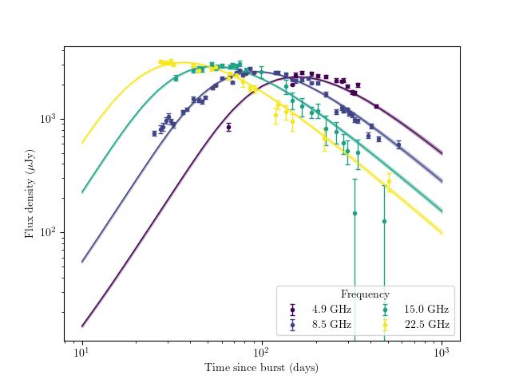
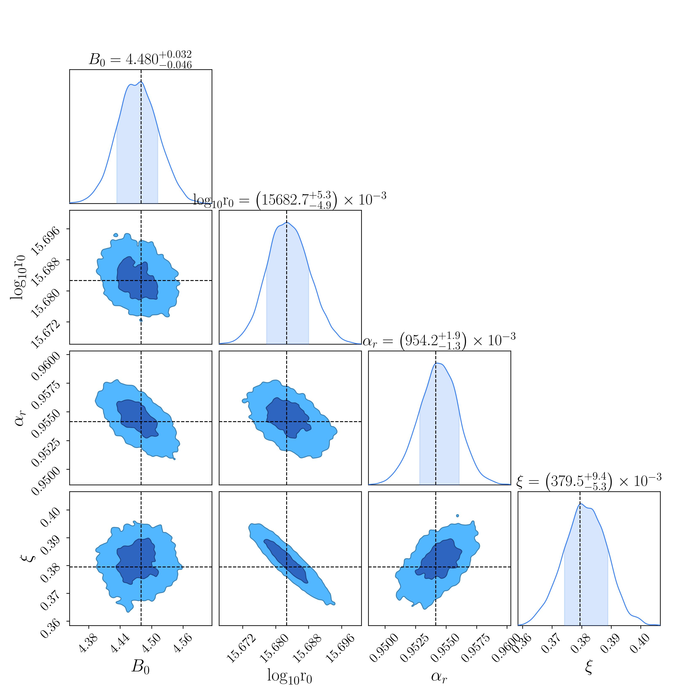

# PySSA  
Python implementation of the Sychrotron Self Absorbed (SSA) model from
[Soderberg et al. 2005](https://ui.adsabs.harvard.edu/abs/2005ApJ...621..908S/abstract)

## Usage 
- Use `PySSA.py` to generate an SSA lightcurve for your choice of parameters. 
- The `plot_lc.py` code allows you to make the lightcurve  plot. Here the example shown is to reproduce figure 2 of the above paper. 
- The `comprehensive_soderberg_data.csv` file contains the relevant data from the above paper to plot the light curve for supernova 2003L.

   

  Here is the output lightcurve. Compare this with Figure 2 of <a href="https://ui.adsabs.harvard.edu/abs/2005ApJ...621..908S/abstract">Soderberg et al. 2005</a>

- Use `SSA_MCMC_fit.py` to perform fit of the SSA model. `MCMC_plotter.py` helps to plot the corner plot and the walks (see the package [ChainConsumer](https://samreay.github.io/ChainConsumer/)).
- Use `plot_lc_best_fit.py` to plot the best fit returned by the SSA MCMC fitter. Also plot the error region for the best fit line.

   

   

   

  Corner plot (top) and walks (bottom) obtained after SSA fit on the SN2003L data <a href="https://ui.adsabs.harvard.edu/abs/2005ApJ...621..908S/abstract">Soderberg et al. 2005</a>

## To do

- Make calculations of integrals faster in `PySSA.py`
- Add plotter script to plot error in best fit model
- Add list of dependancies 

